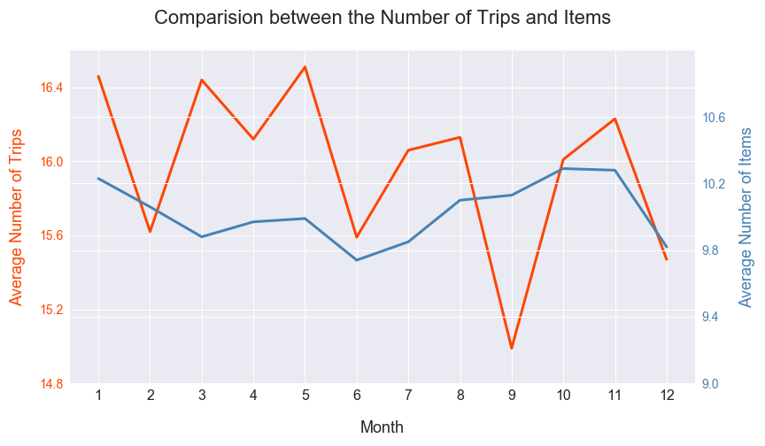
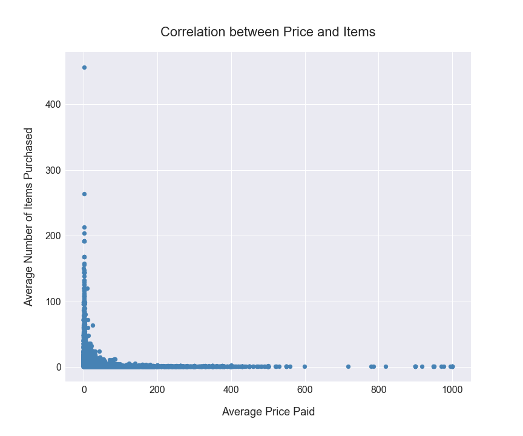
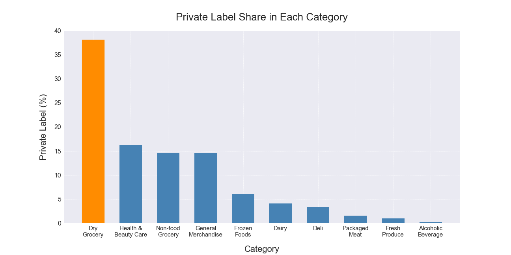
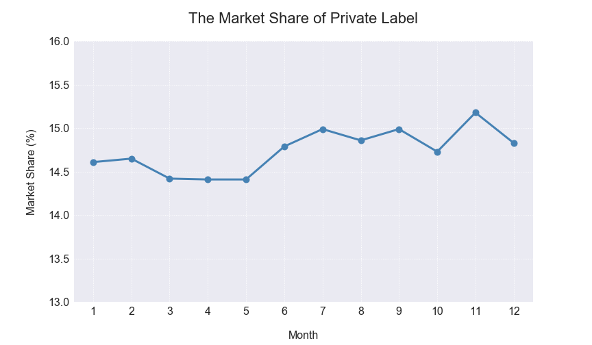
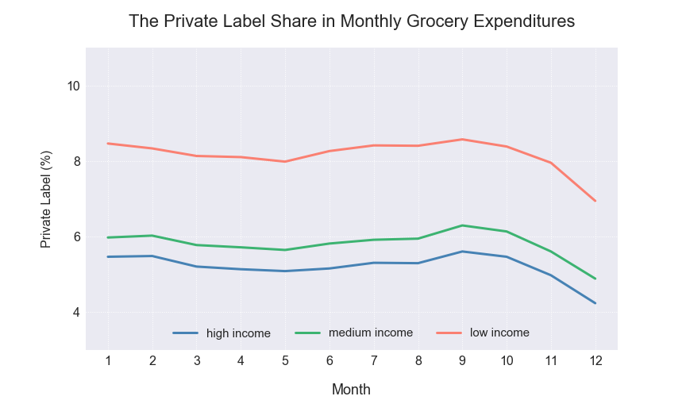
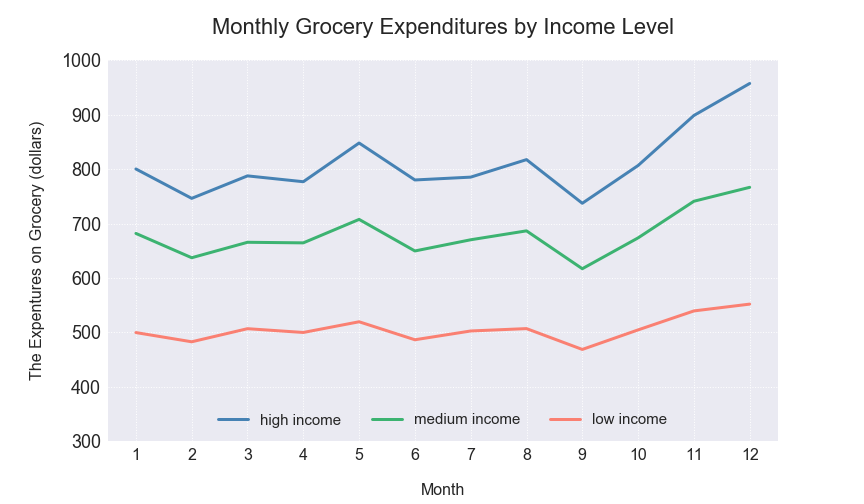
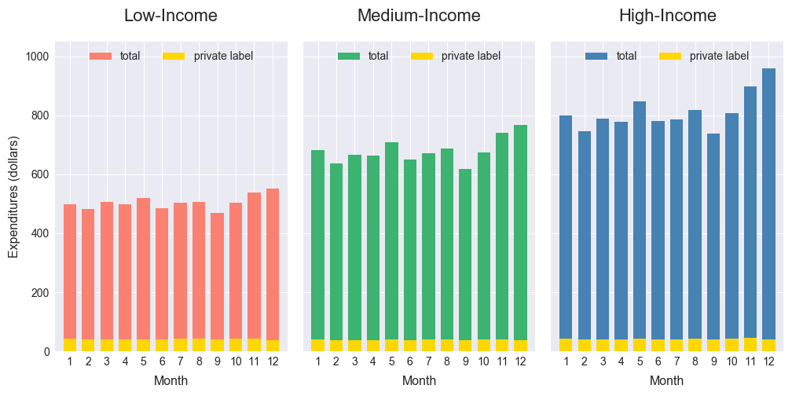

# Grocery Shopping Behavior Analysis

## Introduction

There are two parts in this task. First, I designed and created a relational database with 4 tables and 50+ million observations in total. Then, I explore consumer behavior and market opportunities for private label products by querying data by MySQL and visualizing results by Python Matplotlib.

## Methods

**Tool:** MySQL, Python Matplotlib

**Skills:** Database Design, Database Query, Exploratory Analysis, and Data Visualization

## Database Schema

## Exploratory of Consumer Behavior

### 1. Purchase Frequency vs. Average Number of Items

In most months, the number of shopping trips and items both have the same trends. For example, from June to August, there is a rising trend in the average number of trips and the same trend also shows in the average number of items. However, in March and September, there is an opposite trend in trips and items. In March, the average number of trips increases, but the average number of items decreases. Conversely, the average number of trips decreases, but the average number of items increases. 

	
	

### 2. Average Payment vs. Average Number of Items

​      Yes, the average price paid per item is correlated with the number of items purchased. From the scatterplot, the distribution of points shows “L-shape”. It implies that when an item has a lower unit price(about less than 20 dollars), the range of numbers that people are willing to purchase will be large (from 0 to 480). That is, people are willing to purchase more products when the unit price is low. On the other hand, when the unit price goes up more than 100, people tend to purchase few units of products. In fact, lots of points centralize in the bottom left corner. It represents that when an item charges a medium price (about 20~100), people tend to buy less than 100 units.

	
	

### 3. Private Labeled Products

Private Labeled products are the products with the same brand as the supermarket. In the data set, they appear labeled as "CTL BR". The category **Dry grocery** has more “private labeled” products, which accounts for about 38% in this category.

	
	

### The Market Share of Private Label Products

The expenditure share in Private Labeled products is generally constant across months, although there is a slightly upward trend from about 14.5% to 15.3%.

	
	

### The Market Share of Private Label Products in Different Income Levels

At first, I define three kinds of income level as the following:

●   Low income: < \$49,999

●   Medium income: \$50,000 - ​\$99,999 

●   High income: > \$100,000

​      In monthly grocery expenditures, high-income households spend the most, medium-income is the next, and low-income households is the last. Overall, All income levels have a similar trend on monthly grocery expenditures. Before September, the trend maintains constant, but significantly goes up after October. 

	
	

However, in the private label share, low-income households spend the most on the private label products, medium-income households are the next, and the last one are low-income households. Overall, there is a consistent trend in three kinds of households. Before October, the trend keeps constant, but dramatically goes down after October.

	
	

When comparing expenditures between all groceries and private label in all income-level households, we can see the total cost of private label products are similar and constant in three categories of households across months, even if the total expenditures on groceries are different.

	
	

 

 