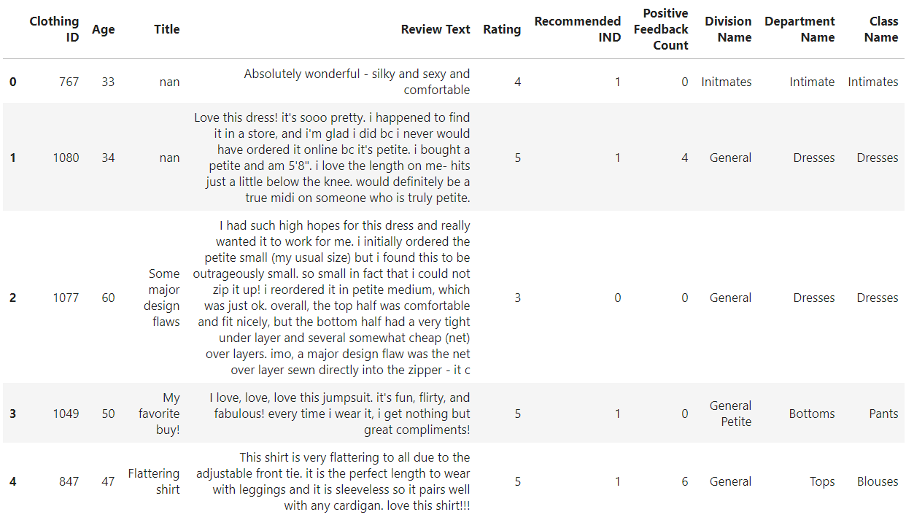
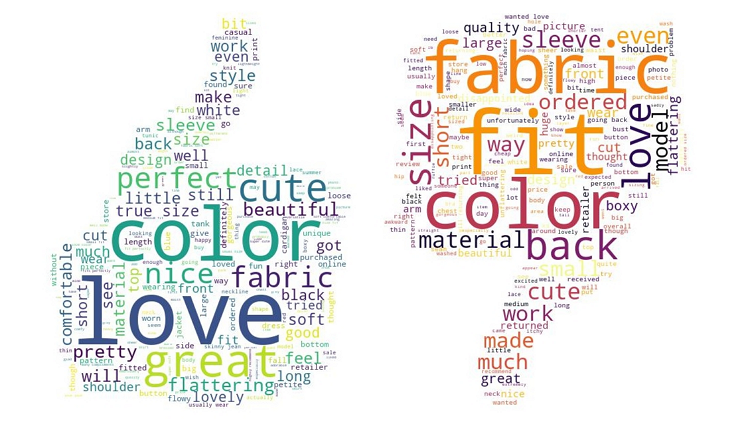
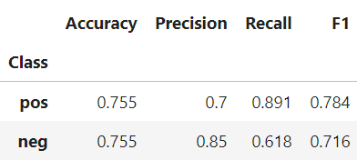

# Clothing E-Commerce Reviews Sentiment Analysis

Nowadays customers can express their thoughts more openly than ever before and people tend to rely on these opinions to help them make decisions. A positive or negative review might dramatically influence a brand's image. Therefore, it is important for businesses to listen attentively to their customers and react promptly. By understanding customers' likes and dislikes, brands can improve their products to meet their needs. Besides, businesses are able to get insights that help develop strategies, such as marketing plans for different customer segments. 

This analysis consists of two parts. In the part 1, I will perform an exploratory analysis to have a initial understanding of our data. In the part 2, I will implement a Naïve Bayes algorithm I have built previously to conduct a binary classification.

## Data Overview

Women’s Clothing E-Commerce dataset is a real commercial data from [Kaggle](https://www.kaggle.com/nicapotato/womens-ecommerce-clothing-reviews). It revolves around the reviews written by customers and includes 9 variables. 

	
	

## Exploratory Analysis

There are 8748 reviews in our dataset. Over 80% of reviews are positive while less than 20% are negative. Overall, most of customers have great impression for dress products. It is a good news for businesses. However, it posts an imbalanced classification challenge because the number of positive reviews is far more than the other one. In addition, negative reviews generally is more important than positive reviews since they might cause damages to brands. To solve this problem and gain better results, I will consider other metrics rather than accuracy rate that people commonly used when training the model. 

	
	

When we break down each sentence and count the frequency for each word, the results are presented in the following graph. We can notice that most of frequent words are preposition

	
	

	
	

Then, I perform word clouds to extract frequent words in positive reviews and negative reviews, respectively. The more frequent a word appears in reviews, the bigger it will become. It is worth mentioning that I remove some common but meaningless in this case, including stop words (such as “the”, “is” and “and”), dress-related words ('top' and 'shirt'), and verbs (such as "look" and "think"). 

	
	

	
	

	
	

	
	

	
	

	
	

