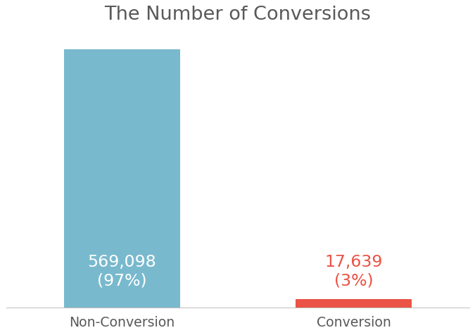

# Channel Attribution Modeling in Digital Marketing

### Table of Contents

* [Channel Attribution and Business Problems](#channel-attribution-and-business-problems)
* [Heuristic Methods](#heuristic-methods)
* [Markov Chain](#--markov-chain--)
* [Dataset and Exploratory Analysis](#dataset-and-exploratory-analysis)
* [Modeling Results](#modeling-results)
* [Interpretation of Results](#interpretation-of-results)

## Channel Attribution and Business Problems

When I worked at advertising agencies, one of the primary tasks was to allocate the advertising budget. Generally, in online advertising, a channel's historical performance, such as CPC (Cost-Per-Click) or CPA(Cost-Per-Action), is a good reference to determine its spending. If a channel can stimulate more clicks or conversions, it is intuitive to invest more in it.

However, the conversion has probably resulted from several channels. For instance, a customer may be aware of a clothing brand through Facebook posts. When googling more information, a Google Search ad jumps out. Due to a banner on a website, the customer decides to click it and even make purchases.

So, the convention should be attributed to which channel? 

The solution is to conduct **channel attribution modeling**. We can assign credits of conversion to channels according to specific rules or models and thus evaluate their marketing importance. Overall, it can help businesses to address the following problems:

- Which channel or media may bring more conversions or profits?
- How to allocate budget to different channels and media?
- Is it possible to sketch our customers' journeys? 

In this article, to explain the concept of channel attribution, I will introduce **heuristic methods** first. Subsequently, through a probabilistic model, **Markov Chain**, we can model channel attribution in an entirely distinct and innovative way. Lastly, I am going to apply real-world data to these models.

 

## Heuristic Methods

To understand how these methods work, I borrow an example of data that records three customers' journeys. In this case, a company only launches advertisements on Paid Search (PS) and Facebook (FB). The column `path` represents sequences of ads customers have passed through, and the column `conversion` indicates whether a customer eventually converts.

	
	

We can notice that two customers convert in different paths. One experiences more Paid Search, whereas the other one spots more Facebook ads. However, which channel is more important, and is it worth for the business to invest more?

Now, I will use three types of heuristic methods to determine credits of channels.

 

#### **Heuristic (1) : Last Touch**

The most intuitive way is to assign all credits to the last touchpoint.

	
	

- Both conversions from Paid Search and Facebook are 1. Thus, two channels have the same credits in the last-touch method.
- Yet, this method doesn't consider the effects of previous channels. Perhaps previous channels successfully make customers impressed, and the last channel luckily gets all credits.

  

#### **Heuristic (2) :** **First Touch**

First Touch is to assign credits for the channel which a consumer initially meet.

	
	

- Both conversions from Paid Search and Facebook are 1. Two channels have the same credits, and the results are the same as the last-touch method.
- Nevertheless, this method also neglects impacts from other steps of channels. In reality, customers may not notice the first ad since they are used to neglect ads on a website or social media.

  

#### **Heuristic (3) : Linear Touch**

Linear Touch is to distribute credits to each channel equally. 

	
	

- Conversions from Paid Search = 1/5*4 + 2*1/6 = 1.13
- Conversions from Facebook = 1*1/5 + 4*1/6 = 0.87
- **Paid Search** apparently has more credits than **Facebook**.
- Although the method solves the drawbacks of the previous two methods, it disregards the heterogeneity of channels and treats all channels equitably.

## **Markov Chain**

Markov Chain is an approach to take sequences as inputs and model probabilities of transitions between channels and conversions. It is possible to consider all customer journeys instead of only one step to assess how much a channel can contribute. Moreover, probabilities can assist in distinguishing channels and giving different levels of credits.

To make it understandable, I use the precedent example to illustrate how to deploy the Markov Chain model in channel attribution.

 

### **Step 1. Specifying paths and states**

Markov Chain considers each channel as a state and includes three additional states, `Start`, `Conversion`, and `Null`. Each path starts from a `Start` state and ends in a `Conversion` state or a `Null` state.Thus, we can transform paths into the following format.

	
	

 

### **Step 2. Computing Transition Matirx**

Markov Chain assumes only the previous state can influence the probabilities of the next states. We just consider transitions from one state to another state. First, we can create a table of which rows represent current states, and columns are the next states. Then, we can regard each arrow in a path as a transition and fill their count in the corresponding cell. For instance, there are two arrows from `Start` to `Paid Search`, so the value in the row `Start` and the column `Paid Search` should be 2.

	
	

By dividing each cell by its sum of the row, counts can be turned into probabilities.

	
	

- The column `Start`, the row `Conversion`, and the row `Null`, are redundant in this case, so I remove them to make the table look clearer.
- We can interpret each value as a probability to different next states, given that the observation is in a certain state. For example, if an observation is currently in the `Start` state, it has a 67% probability of going to `Paid Search` and a 33% probability of heading to `Facebook`.

  

###  **Step 3. Computing the total converstion rate**

We can visualize the previous transition matrix to the following:

	
	

It is much clear to see the dynamics between channels, and thus we can calculate the total conversion rate now. First, I list all possible paths to conversion and calculate their probabilities to happen. To avoid meaningless repeats, I do not consider any recurrent transition, such as from `Paid Search` to `Paid Search`. Eventually, there are 4 paths to conversion, and the sum of the conversion rate is 18.68%

	
	

**Total Conversion Rate** = 0.0938 + 0.0403 + 0.0462 + 0.0065 = **0.1868**

  

### **Step 4. Computing Removal Effects**

To evaluate the importance of each channel, I will measure their removal effects. Remove effects is the change of conversion rate if we remove a channel. The larger the difference is, the more critical a channel is.

**1. Removing `Paid Search`**

	
	

	
	

- Conversion Rate without Paid Search = **0.0462**
- Removal Effect = 0.1868 - 0.0462 = **0.1406**

  

**2. Removing `Facebook`**

	
	

- Conversion Rate without Facebook = **0.0938**
- Removal Effect = 0.1868 - 0.0938 = **0.093**

  

### **Step 5. Assign credits based on removal effects**

Finally, I sum all the removal effects and compute the percentage for each channel.

	
	

  

### Step 6. Evaluating Results

For the Markovian approach, we can notice that Facebook has more contribution than Paid Search. When comparing to heuristic methods, the Markovian result is entirely different and even converse to the linear-touch method. It is because the heuristic approach tends to give higher credits for channels that appear frequently. Nonetheless, the Markov Chain model can mitigate this kind of bias since it uses probabilities rather than raw counts.

	
	

 

## Dataset and Exploratory Analysis 

It's time to deploy the prementioned models in a real-world dataset. I choose an online advertising dataset acquired from [this article](https://towardsdatascience.com/marketing-channel-attribution-with-markov-chains-in-python-part-2-the-complete-walkthrough-733c65b23323). It tracked customer journeys from July 1, 2018, to July 31, 2018, and detailedly recorded when each ad showed up, which customer it reached, and whether the customer successfully converted. 

For example, for the first cookie, its journey includes four states: Instagram > Online Display > Online Display > Online Display. Unfortunately, the user did not convert during the observed period, and thus both conversion and conversion value are 0.

	
	

	
	

- Total conversion rate is about 3%. This dataset has imbalanced classes.

	
	

- Facebook and Paid Search have relatively higher impressions.
- Instagram and Online Display showed less frequently compared to other channels.

## Modeling Results

R has a great package designed for channel attribution, called **ChannelAttribution**. It can be used to build models based on heuristic and markovian approaches, respectively. To evaluate the Markov Chain results, I simultaneously run heuristic models and regard them as base models.

Here are the results.

### **1. Distributions of conversions**

	
	

### **2. Transition matrix**

	
	

### **3. Removal effects**

	
	

## Interpretation of Results 

### 1. Distribution of Conversions

	
	

- Facebook has the most credits in conversions and it accounts for almost 30% of total conversions. 
- Online Display has the least credits and it only occupies for approximately 10% of total conversions. 

  

### 2. Conversions by Channels

	
	

Overall, four approaches all agree Facebook contributes the most, and Online Display has the least credits. However, it is noteworthy that they have different viewpoints about Instagram. For heuristic methods, Instagram's conversions are similar to Online Display's. Yet, the Markov Chain model assigns more credits to Instagram and allows its conversions to exceed Online Video's values. As I have mentioned before, the frequency of channels is associated with their credits in heuristic models. Conversely, the Markovian method can eliminate the influence of the total occurrence

  

### 3. Conversion Rates (Markov Chain) 

To examine the efficiency of each channel, I divided the conversions of each channel by its impressions and presented the results in the following graph.

	
	

Instagram has the highest conversion rates, 4%, and is far more than other channels. Thus, we can consider Instagram the most efficient channel because it can bring about more conversions, given the same impressions. It also reveals that it has a certain level of influence to stimulate customers to convert.

  

### 4.  Transition Rate

The transition matrix outlines relationships and interactions between channels and states. Thus, we can inspect some customer behavior and habits.

	
	

- In row Start, we can see the initial probabilities of different states. It roughly corresponds to the distribution of impressions. As we have seen in EDA, Facebook and Paid Search has more impressions, but other media have lower impressions. It indicates customers' first reach media is more likely to be Paid Search and Facebook.
- In column Null, we can observe that Instagram and Facebook have a lower probability of the null state than Online Video, Paid Search, and Online Display. Especially, Instagram has the least possibility. This result can explain why Instagram has a lower impression but higher credits in conversions.
- Facebook and Instagram have a higher probability of transiting to each other. Customers heavily rely on social media, and they often see ads on two platforms at the same time.
- Facebook and Instagram do not directly lead to conversion but also are less likely to the null state.