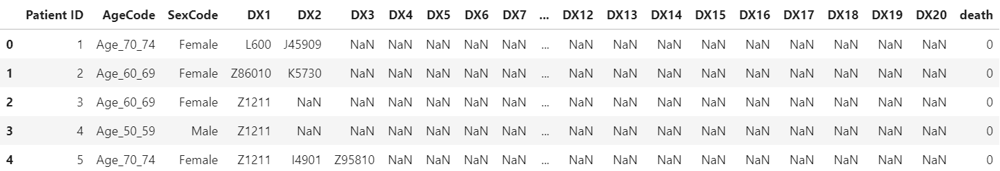
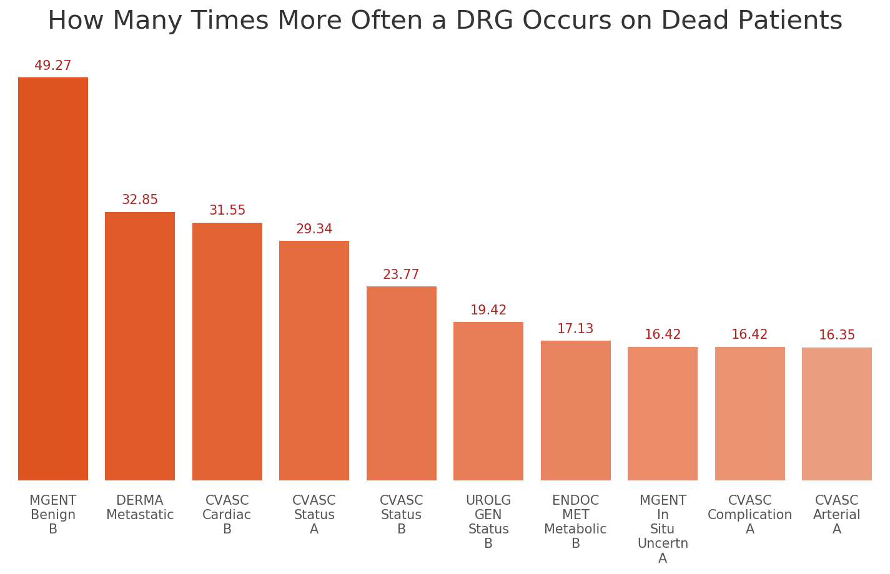
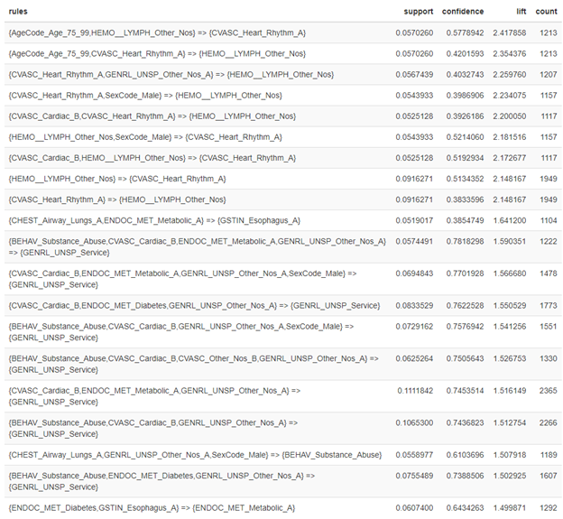
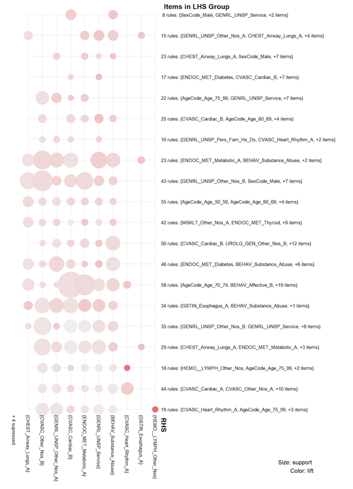
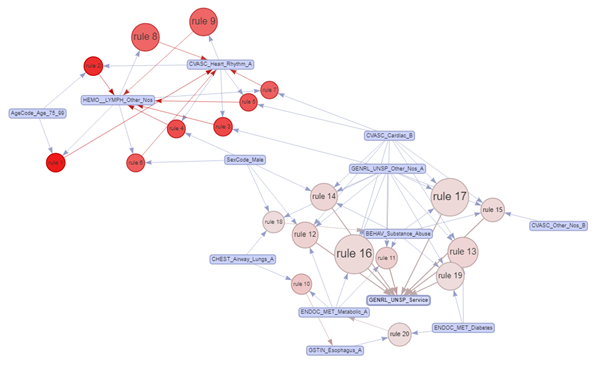

# Research on Comorbidity of COVID-19

## Introduction

Predictive models can show the relationships between mortality and symptoms but cannot reveal how different symptoms interact with each other and which features often co-exist. Some diseases might appear more frequently on the patients who died. Some disorders are possible to be accompanied with specific symptoms. These conditions are likely to be the reasons to increase the death rate of COVID-19.

 

## Tools

Python: Data Wrangling and Visualization ()

R: Association Analysis ([Rpub Link](https://rpubs.com/crystalwanyulee/656668))

## Dataset

The COVID-19 patient dataset is a synthetic data, which is created from scratch according to real world correlations and relationships of many variables and aspects so naturally there is no source in the real world for such data. In fact, there are articles and methodologies as how to create them to resemble the "real world" data.

This dataset includes some information about patients, including demographics, diagnosis codes, and mortality. Here is what our mock data looks like:

	
	

## Exploratory Analysis

	
	

     <i>Figure 1</i> 

**Figure 1** exhibits the most frequent DRG categories appearing on the dead patients. The red bars show how many percentage points the patients who died had those DRGs. The blue bars present the probability of the same DRG happening on the patients who recovered. Overall, “CVASC_Cardiac_B”, “ENDOC_MET_Diabetes”, “CVASC_Arterial_A”, “CHEST_Status_A” and “UROLG_GEN_Other_Nos_B” occur more often among dead patients. The results are consistent with the outcomes in predictive models.

	
	

     <i>Figure 2</i> 

Moreover, I computed the probabilities of each DRG happening on the dead and recovered patients, and then compared those possibilities between two groups of patients in **Figure 2**. It is noteworthy that some categories jump out. Some categories, such as “MGENT_Benign_B”, “DERMA_Metastatic”, are never shown in the previous results. 

## Association Rules Mining with DGK Combination

In order to further uncover unconscious patterns, I conducted association rule mining to identify which features have strong relationships and research the possible causality. Since some packages in R, such as arules and arulesViz, can provide more attractive visualization and interesting insights, I will conduct the association analysis in R.

At first, I listed all kinds of combinations of features and computed their association. After filtering out relatively infrequent and unimportant associations and removing redundant and duplicate rules, we gained 616 rules in total. I showed the top 20 rules in **Table 1**.

	
	

     <i>Table 1</i> 

Each rule includes an antecedent on the left-hand side of an arrow and a consequent on the right-hand side. The antecedent can be a set of features, but the consequent only consists of a feature. To summarize the results, I used K-means clustering to combine similar rules and visualized aggregated measures in a balloon plot (**Figure 3**). 

 

	
	

     <i>Figure 3</i> 

Each row represents the left-hand side of rules, whereas each column shows the right-hand side of rules. Circles indicate associations between LHS and RHS. The size of circles represents support, which measures how often the rules appear in our dataset. The color shows lift, which determines how likely LHS and RHS are dependent on each other. In sum, we can notice there are two patterns in the plot.

1. Most of the circles are shown in the middle columns. We can suggest that these rules are frequent combinations of symptoms among the dead patients. 
2. There are two dark red circles, indicating a relatively strong association. From those rules, we can conclude that “HEMO_LYMPH_Other_Nos”, “Age_75_99”, and “CVASC_Heart_Rhythm_A” are apparently correlated with each other.

  

To further investigate these rules, I selected the top 20 association rules based on the values of lift and presented them in a network diagram (**Figure 4**). Each circle is an association rule, in which the size represents support, and the color shows lift. Each feature passes through a rule and interacts with another feature. Blue arrows are the way that an antecedent heads on, while red arrows indicate where the destinations are.

	
	

     <i>Figure 4</i> 

Overall, there are two primary networks in the graph. The one in the top left and the other one in the bottom right. In the former one, we can discover that there is a strong correlation between "AgeCode_Age_75_99", "HEMO_LYMPH_Other_Nos", "CVASC_Heart_Rhythm_A", and "CVASC_Cardiac_B". On the other hand, in the latter one, features seem to be less dependent on each other, but most symptoms lead to the same destination, "GENRL_UNSP_Service". 

