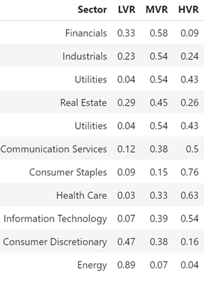

# The Market Shocks of COVID-19

## Introduction

In this project, I would like to look into S&P 500, a stock market index, and see how the coronavirus health crisis has impacted the 11 underlying sectors of the S&P 500 with our main focus on the healthcare industry’s present and future outlook. I first analyzed the percentage change in stock price during the period between February 14 to March 23, and calculated the value retention together with the market cap for each company in S&P 500, in which companies are highly representative of their underlying industry. Based on this information, we then delivered a broad overview of the current situation in the Energy and the Financials sectors. 

## Exploratory Analysis

As we can see, the average stock price in the S&P 500 dropped dramatically during March and arrived at the lowest point on Mar 23. The stock market gradually recovers after a month  on Apr 16. It is really interesting to study which sector is especially vulnerable to the crisis. 

	
	

If we break down companies in S&P 500 into 11 Sectors, we can see that the top 3 sectors are Industrials, Information Technology, and Financials, which account for about 40% of companies in S&P 500.

	
	

The top 3 sectors with the highest average stock prices are Consumer Discretionary, Communication Services, and Health Care. Prices in these three vectors also have a steeper downward trend during March, compared to other sectors. However, in mid-April, all sectors gradually rise back, although the Energy sector seems to maintain its price in a downturn. 

	
	

By considering market cap, we can quantify how serious the market crash is. Market cap, also referred to as Market Capitalization, represents the total dollar market value of a company's outstanding shares of stock, according to [Investopia](https://www.investopedia.com/terms/m/marketcapitalization.asp). The graph on the right-hand side displays how much market values each sector possesses in S&P 500 before the crisis. Sector Information has the highest market cap. Although its average stock price is not the highest average stock price, it has the most number of companies. However, Communication with the second highest market cap, has a relatively higher average stock price but the least number of companies. 

	
	

If we multiply market cap by the decreasing rate of the stock price, then we can notice that there is a loss of 10, 431 Billions. That is a really huge crash for the stock market!

## Computing Value Retention

Now, I will try to calculate value retention for each company to measure the market crash. Value retention represents how much value a company has after experiencing a crisis. It can reveal a current status for each company compared to a specific time and disclose how robust a company is in the coronavirus crisis. To calculate it, we first have to compute how many percentages a stock price decreases and then use 100 to price the percentage change. 

$$Percentage Change=\frac{(P_1-P_0)}{P_0} \times 100\%=d\%$$

$$ValueRetention=100+d$$

For example, if Disney's stock price is 139.54 on February 14 and 85.76 on March 23, the percentage decrease is calculated by $(85.76-139.54)/139.54 = -38.54\%$. Next, value retention is $100+(-38.54)=61.46$. How can we interpret the result? Suppose the stock price on February 14 is 100, on March 23, only the 61.46 values left. 

If this value is close to or above 100, we can conclude that the company is relatively immune to the crash. However, lower values mean that the firm is more vulnerable to the crisis. In our example, we can see Disney loses almost the 40% stock price and keep only 61.46 values. It is definitely a significant drop for a company. The decrease probably results from investors' expectation that people will cancel all outdoor activities and choose to stay at home to prevent infection. 

## Conducting Clustering and Evaluating results

After calculating value retention, I implement clustering methods to segment companies in S&P 500. Here I applied two clustering algorithms, K-means and K-medians and presented the results in **Figure 5**. To avoid any group with very few companies in it, we compared the smallest cluster in two approaches and highlighted them in blue color. K-medians has at least 118 companies in a cluster, which is larger than 116 in K-means, so I decided to adopt the results of K-medians.

	
	

#### **Re-labeling Clusters**

To recognize the difference between clusters and re-label them based on value retention, I computed average value retention of each cluster **(Table 1)**. Cluster 1 has the smallest value retention, and thus it is reasonable to regard it as the Low-Value Retention Cluster (LVR). The largest one is Cluster 2, so it is supposed to be the High-Value Retention Cluster (HVR). Because Cluster 3 is in the middle, I can view it as the Medium Value Retention Cluster (MVR).

 

| **K-median  Clusters** | **#  of Companies** | **Weighted  Average VR** | **New  Label** |
| ---------------------- | ------------------- | ------------------------ | -------------- |
| Cluster 1              | 118                 | 42.11                    | LVR            |
| Cluster 2              | 176                 | 74.94                    | HVR            |
| Cluster 3              | 211                 | 59.40                    | MVR            |
| *Table 1.*             |                     |                          |                |

 

## **Analyzing the Composition of the Clusters**

Now, I want to inspect companies belonging to what kind of sectors in a cluster. For each sector, I computed the number of companies in each cluster and divided it by the total number of companies in a sector (**Table2**).

	
	

Subsequently, by visualizing the above results through a parallel coordinate plot (**Figure 6**), I can have a glance at the change of the composition in three clusters. Vertical lines represent three clusters. Each trend line represents a sector, and colors of lines differentiate their trends. Red lines show the downward trends, meaning that most firms in a sector belong to LVR. Blues ones are the increasing lines, indicating that companies of a sector are mostly aligned with HVR. Lastly, the sector is colored in grey if businesses within it are majorly located in MVR.

 
	
	

In LVR, Energy and Consumer Discretionary have high proportions of companies. I can suggest that these two sectors are susceptible to the Coronavirus crisis. Notably, about 90% of companies in Energy belong to LVR, demonstrating that energy industries are greatly harmed by Coronavirus. This result is consistent with our finding in Question 2.

In MVR, Financials, Utilities, Industrials, and Real Estate become more significant than in the previous cluster. All of them are at the top of MVR. Consumer Discretionary slightly decreases but keeps a certain amount of proportion. However, Energy dramatically goes down and almost disappears. As for blue lines, Health Care and Information Technology and Communication Services start moving up, whereas Consumer Staples stay insignificant.

In HVR, Consumer Staples, Healthcare, Information Technology, and Communication Services far exceed other sectors, implying that these sectors are relatively more robust than other industries. In particular, Consumer Staples considerably rises to about 80%, although the line of it looks flat in the previous two clusters. It points out that Consumer Staples has an excellent capability to overcome this hard time. Additionally, Utilities, Real Estate, and Industrials decline but stay a certain amount of proportion. Yet, Consumer Discretionary and Financials decline close to 0.

**Considering Market Cap to Examine the Change in Clusters**

In the previous plot, I assumed all companies to have the same scale. In fact, different sizes of companies might cause different influences on the industries. Thus, this time I added the market cap factor into our analysis to quantify how large an influence a company can bring. Instead of calculating the number of companies, I summed values of the market cap in each cluster and divided it by the total amount of market cap in a sector. The results are visualized in **Figure 7**.

	
	

The energy sector still stays in the weak group, but the consumer discretionary sector switches to the strong class. It shows that most corporations in Consumer Discretionary have lower value retention but also have a smaller market cap. Thus, they cause relatively little influence on the market. The finding matches the conclusion in Question 1. Amazon is the biggest company in this industry with a huge market cap, $1063 billion (compared to the second largest one, Home Depot, with $264 billion). Because consumers can gain products through e-commerce, Amazon can continue to make profits and retain 89% values. It successfully mitigates the negative impact of Coronavirus on the consumer discretionary sector. 

In addition, Communication Services here become the top one in HVR. It implies that companies of HVR in Communication Services might be large enough and be able to retain relatively more value in a difficult time as well. Netflix and Verizon are the bigger companies in this industry and retain 94% and 85% of market cap. Obviously, two companies contribute a lot on the market.

In the financial sector, its line looks more symmetric and less steep than the previous one, but most firms in the financial industry remain in MVR. The result is not surprising because I have illustrated there is a trivial difference in the average value retain between companies with higher market cap and lower market cap. 

As for the healthcare sector, companies are primarily in HVR. Only a few of them are classified into MVR and LVR. According to the explanations in Question 4 and 6, I can suggest that healthcare insurance companies might be those retaining fewer values, whereas other companies, such as health technology or pharmaceutical companies might be in the high value retain group.

