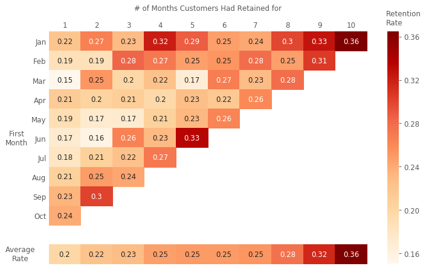

# Know your business through Exploratory Analysis and Cohort Analysis

#### Table of Contents

* [Dataset](#dataset)
* [Exploratory Analysis](#part-1-exploratory-analysis)
* [Cohort Analysis](#part-2-cohort-analysis)
* [Conclusion](#--conclusion--)

## Dataset

In this project, I use a dataset concerning online retail from [UCI ML repository](http://archive.ics.uci.edu/ml/datasets/online+retail). It includes 8 variables and records 4372 customers as well as their orders, which are around 25,900 unique orders of 4223 products. Each row represents an item within a purchase. `InvoiceNo` is used for recognizing different transactions, and `CustomerID`tells us who made this purchase.

	
	

 

## Part 1. Exploratory Analysis

### 1. Monthly Sales

The goal of marketing is to increase revenue, so it is a good start to investigate the company's profitability.

	
	

Two observations from the monthly retail sales: 

- Overall, the sales went up across months. It is good news for a company.
- Revenue after August had a significant change. In the first half of the year are relatively low and remained between 469K to 645K, whereas the monthly revenue significantly rose from September. I suggest that some changes happened in marketing strategies during August and September. 

 

### 2. The Growth Rate of Sales

	
	

- Before August, revenue had been boosted two times, which happened in March and May. However, the increasing trend did not go on to the next month.
- After August, the revenue continued to grow without going down. 

 

### 3. The Composition of Customer for each Month

	
	

- The plot exhibits how many customers made purchases and each line represents the class of customers.
- From August to September, both the numbers of new customers and existing customers apparently increased.
- Even if the new customers started rising slowly after September, existing customers kept moving up, and thus revenue increased as well.

 

### 4. Investigating Customers in August and September

	
	

To investigate what actually happened in August and September, I compare customers in two months and examine when they started their first purchases.

- In both months, a large proportion of customers were not new customers and began to buy before December 2010.
- September had more customers who started first purchases before July. However, seldom customers came from August because new customers might not immediately go shopping in the next month.
- In fact, the additional sales in September came from both new customers and repeated customers.

 

### 5. Source of Revenue

	
	

- By comparing the contribution of existing and new customers, except for in January, recurrent customers obviously bring about more profits than new customers. This gap between their contributions become much broader in the second half of the year.
- Benefits from repeated customers are considerable, although they require time to fetch. 

 

## Part 2. Cohort Analysis

As I observed before, new customers usually did not instantly generate high values, but if they are willing to come back, they can bring more and more sales. To examine customers' behavior from when they started buying, I executed a cohort analysis to measure metrics in different cohorts over time.

 

### 1. Retention Rate 

I categorize customers into 10 groups according to the month of their first purchase and inspect how the retention rate fluctuated across months. Each row represents a group. For instance, row Jan means those customers who made their first order in January 2011. Columns are relative to the number of months customers had retained. The darkness of colors shows the retention rate. If the color is close to dark red, the retention rate is higher. 

	
	

- Cells in the diagonal line tend to have darker colors, indicating that those cells have higher retention rates.
- Average Rate, at the bottom of the plot, demonstrates that the longer time customer has retained for, the higher average retention rate is. It proved that new customers might not make purchases immediately in the next month, but they are likely to come back in the future.

 

### 2. Average Spending for an Individual Customer

	
	

- The graph is insightful and disclosed an really interesting fact: Cohorts in January and August perform far better than other groups.
- Customers who joined in January had the highest average spending when they retained for one month (in the first column). Subsequently, they continued to contribute more and more value over time. We can view them as customers with a higher loyalty.
- Customers who are acquired in August are notably profitable. In merely two months, they doubled the average spendings. We can conclude that marketing in August was surely successful because it remarkably raised revenue and cultivated a group of valuable customers.

 

## **Conclusion**

- We can infer that the business might change their marketing strategy or launch a campaign that successfully attract new customers and even win old customers back.
- Increasing the retention rate is helpful for businesses to increase revenue. Thus, the company should first identify which customers are likely to be retained and further plan strategies to communicate with them.