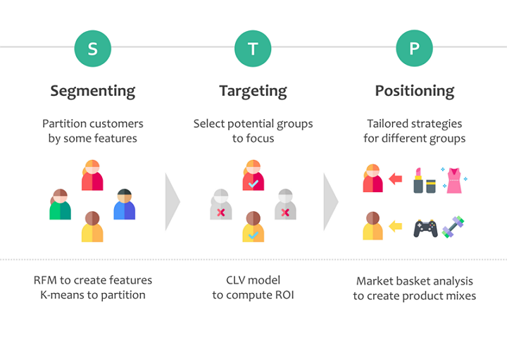

# Customer Segmentation by RFM analysis and K-means Clustering

 

Table of Contents

  * [Part 1. STP Model and Business Problems](#part-1-stp-model-and-business-problems) 
  * [Part 2. What is RFM Analysis?](#part-2-what-is-rfm-analysis-)
  * [Part 3. Feature Engineering through RFM Analysis](#part-3-feature-engineering-through-rfm-analysis)
  * [Part 4. Segmentation by K-Means Clustering](#part-4-segmentation-by-k-means-clustering)
  * [Part 5. Interpretation of Clusters](#part-5-interpretation-of-clusters)
  * [Part 6. Customer Profiling and Suggestion](#part-6-customer-profiling-and-suggestion)
  * [Part 7. The Potential Problem for the Business](#part-7-the-potential-problem-for-the-business)

## Part 1. STP Model and Business Problems

Due to limited resources and different customer needs, customer segmentation is a crucial way to help businesses efficiently communicate with potential customers and maximize their benefits. 

  

Customer segmentation is the first step of **STP marketing model**, which is a simple and common framework of market segmentation. The goal is to identify a business's current customers and further categorize them based on some characteristics or behavior. Once companies know who their customers are, they can choose some groups as targets and tailor appropriate marketing strategies to communicate with them. It is the process of the subsequent steps, and I will cover them in the next two articles.

In general, customer segmentation can answer the following business questions:

- Who are our customers? 
- What do our current customers look like? 
- Which groups are worth to invest? 

 

To begin with, I will create new features to depict customer behavior through **RFM analysis**. Although the dataset presented details of each transaction, it isn't easy to see information about customers. RFM analysis can transform the transaction-level data into customer-level data by summarizing their purchase outcomes. This process is also called **feature engineering**. Subsequently, I will implement **K-means clustering** to divide customers into different groups depending on the RFM features. At last, I will build customer personas to characterize these clusters. 

 

## Part 2. What is RFM Analysis?

RFM analysis is to use three indicators, recency(R), frequency(F), and monetary(M), to quantify an individual customer's purchase history. To make concepts easier to understand, I present their definition and relationships in the following graph. 

 

- In all features other than recency, higher values are better.
- Recency is more or less associated with retention since we can determine whether a customer is active or not from it.
- Frequency reveals a customer's loyalty. Specifically, if a customer favors a brand, they are willing to visit the store all the time.
- Notably, lifetime is an additional concept I add. In the last time's cohort analysis, I concluded that spending and repeated purchase behavior are related to how long a customer is alive. Thus, I believe this feature is probably helpful to differentiate customers.

  

## Part 3. Feature Engineering through RFM Analysis

Now, it's time to create RFM and lifetime features.

- To calculate recency, I defined a snapshot date as December 9, 2011, which is the next day of the last order.
- Since only recency prefers lower values, here I took negative recency to make all features have the same evaluation.

The new structure exhibits each customer's purchase behavior in each row. For instance, Customer ID 12347 had been alive for 1 year and his or her last purchase was 3 days ago. Plus, he or she had created 7 orders and brought about 4,310 dollars. 

  

#### 1. Checking distributions of new features

#### 2. Remove Outliers

- Definition of outliers: the observations with the value of frequency or monetary exceeding the value in the 99.5 percentile.
- In this case, lifetime and recency are not appropriate to remove outliers, so I did not consider them in recognition of outliers.

- Although skewness still exists, the distributions look better now, and features are able to be applied in the subsequent clustering task.

## Part 4. Segmentation by K-Means Clustering

K-Means is an unsupervised learning model and commonly used in clustering. It computes distances between observations to determine their similarity and further partitions observations. Datapoints within the same group are similar to each other than to those in other clusters. In order to employ the clustering algorithm, we have to finish the following steps.

#### Step 1. Normalizing Data

Since K-means is a distance-based model, the vast difference between scales of variables leads to biased results. Thus, we have to normalize data before deploying the algorithm. 

#### Step 2. Choosing the Best Number of K

K-means requires us to define the number of clusters in advance. To find the optimal one, I tried different values from 2 to 10 to run the model and evaluated the results through two metrics, WSS and Silhouette score. 

WSS measures how compressed each cluster is, and thus it is better to have a low WSS. Yet, the lower WSS is, the more clusters the model produces. Typically, it is unnecessary to have lots of small groups because it is hard to sketch some patterns. Thus, it is common to use the elbow method to find a turning point where WSS starts to decline slowly. In our case, the turning point is probably located at 4 or 5.

Another indicator is the Silhouette score, which measures the distance between clusters and tells us how well the separation is. Generally, it is better to choose the number with the highest Silhouette score. From this point, the best number of clusters is 5.

#### Step 3. Evaluation of the Clustering Results

Now, I will use k=5 to apply the K-Means algorithm again. Since the algorithm could not identify which cluster is better, I compared the average values in each variable and ranked each cluster as the following. To make clusters vivid and inspire more insight, I relabeled them to express their behavior and personas, and I will explain those naming later. 

## Part 5. Interpretation of Clusters 

#### 1. Separation

To inspect the relationships between cluster, I map all data points into 2 dimesntional space through [princial component analysis](https://en.wikipedia.org/wiki/Principal_component_analysis) and depict their positions in a scatter plot. 

- Overall, clusters are separated pretty well. Overlapping is not apparent, meaning that most observations are classified into correct groups.
- VIP and Regular Customers spread wider and have a higher variation. Conversely, Casual Buyers, Novices, and Sleepers are more condensed and are closer to each other.

   

#### 2. Distributions

- Most customers belong to Casual or Novice Buyers.
- Profitable customers, including the VIP and Loyal groups, merely occupy 10% of customers.

  

#### 3. Distinctions

To easily distinguish clusters, I used the scaled data to calculate the average value and visualized the results in a snake plot. The x-axis represents features and the y-axis shows z-scores, which indicates the distance from mean value of the entire population. 

We can recognize different cluster from at least one feature, and clusters can be roughly divided into three levels:

- **Top VIP and Regular Customer:** All features are above the mean. They are alive for a long time and are active all the time. Their contributions are high enough to be loyal customers. The primary differences between subgroups are frequency and monetary.
- **Medium Causal Buyer:** All indicators are in the middle. Although they are alive for a long time and are active all the time, they are not loyal to the business. Thus, they visit once in a while and are not willing to spend a lot each time. 
- **Bottom Novice and Probably Dead:** Almost all values are below the mean. Two groups behave similarly, but they only differ in recency. Roughly speaking, Probably dead buyers are not active now, but novice customers may still alive. 

  

#### 4. Active Periods

- The first three groups have stayed for a while and are currently active.
- Whether Novice buyers are still alive is uncertain. They may stop purchasing and follow the path of the Probably Dead Buyers. Or, they may just in the break between purchases. 

  

#### 5. Average Days between Purchases

- VIP and Loyal Customers usually make at least one order every month, whereas Casual Buyers purchase about every three months. 
- The Novice and Probably Dead groups have a shorter lifetime, so the average time of the gap is more likely to be shorter.

  

#### 6. Average Spending Each Time

$$

- The VIP group's average spending in each order is far higher than in other groups. It reveals that how powerful and loyal the group is.
- It is noteworthy that although Casual Buyers have been retained for a long time, their spending in each time is not higher than the bottom two groups.

  

## Part 6. Customer Profiling and Suggestion

| **Type**      | **Description and Suggestion**                               |
| ------------- | ------------------------------------------------------------ |
| VIP           | Few but the most profitable. Must carefully treat them and keep good relationships with them. Give them some special offers to make them feel that they are valued. |
| Loyal Buyer   | Regularly visit and are willing to spend more. The most prosperous customers to become VIP. Required some game mechanics and rewards to encourage. |
| Casual Buyer  | Stay for a while but visit once a while and contribute a little. Probably often visit our competitors at the same time and thus are more likely to leave any time. Required some incentives to become loyal. |
| Novice Buyer  | Newly acquired buy perhaps not stay for long. Need some discounts or offers to stimulate recurrent purchases. |
| Probably Dead | Hard to win back because they have left for a while. Avoid spending too much effort on them. |

  

## Part 7. The Potential Problem for the Business

 

- Outliers are powerful and able to bring a huge impact to the business.
- Only 80 customers support approximately 40% of sales. It has pros and cons. The good news is that the corporate has exceptionally loyal customers. The bad news is that the business exceedingly relies on a small proportion of customers, and it will lose a lot if some of them leave.
- The company should not only maintain good relationships with the VIP group but also cultivating more and more loyal customers to decrease risks. 

 