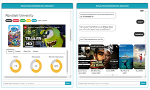

# Data Science Portfolio by Crystal Lee

    |
  <a href="#about">About</a>   |
  <a href="#skills">Skills</a>   |
  <a href="#python-and-r">Python/R</a>    |
  <a href="#natural-language-processing">NLP</a>    |  
  <a href="#mysql">MySQL</a>    |    
  <a href="#data-visualization">Visualization</a>    |  
  <a href="#data-apps">Data Apps</a>    |  
    
  
    

# About

Hi, I am a savvy technical analyst with 4-year experience in data analytics and 2-year experience in fast-paced startup environments. Proficient in SQL, Python, dbt, and various BI tools, such as Tableau and Metabase. 

This portfolio is a compilation of all the data science and data analysis projects I have done for work, academic, self-learning and hobby purposes. 

•	Database: BigQuery, MySQL, PostgreSQL, MongoDB
•	Programming: SQL/dbt, Python, R, JavaScript
•	Data Engineering: dbt, Airbyte, Fivetran, Airflow, Spark 	•	BI Tools: Tableau, Metabase, Google Data Studio
•	Product & Marketing: Segment, fullstory, Jira, Google Ads, Google Analytics

# Data Apps

**[1. Chatbot App](https://publish.acho.io/48ee6f31-36e8-4784-b746-34d890b152bd)**

This Chatbot App built on Acho uses conversational AI to create human-like interactions with users by leveraging OpenAI’s text completion API and Python model. 
 
 
 

**[2. Sales Simulation App with Python](https://publish.acho.io/491)**

This App powered by Python utilizes the Monte Carlo model to forecast sales for a business. Monte Carlo methods are a class of computational algorithms that rely on repeated random sampling to obtain numerical results. 
 
 
 

**[3. Digital Advertising Performance Tracking App](https://publish.acho.io/0e311293-cb08-4ae7-a278-56642acf2749)**

The digital advertising performance tracking app is a tool that helps marketers and advertisers track and measure the effectiveness of their digital advertising campaigns.
 
 
 

**[4. Data Request System](https://publish.acho.io/409)**

A data request system functions enable users to submit requests for data, dashboards, or ad-hoc reports. Data owners have visibility of the requests and can address them accordingly. 

 
 
 

**[5. Pivot Table App]([https://publish.acho.io/409](https://publish.acho.io/67d75941-af95-4112-b0aa-99943a371c68/pivot_table))**
The pivot table app allows users to create and analyze pivot tables, which are a type of data summarization tool used in spreadsheet programs like Microsoft Excel and Google Sheets.
 
 
 

**[6. Virtual Movie Recommendation Assistant](https://github.com/crystalwanyulee/plotly_dash_projects/tree/main/project%203)**

**Purpose:** A chatbot to help users find the movie of interest, and provide recommendations based on the chosen movie  **Methods:** Web Scraping, Finite State Machine, Recommender System, Web Application **Tools:** Python, Plotly Dash 
 
 

**[7. Loan Analytics Calculator and Dashboard: ](https://github.com/crystalwanyulee/plotly_dash_projects/tree/main/loan_analytics)**

**Purpose:** A web application to calculate monthly payment for multiple loans in tables and charts  **Methods:** Data Visualization, Web Application **Tools:** Python, Plotly Dash 

 
 

**[8. Route Planner and Network Analysis](https://github.com/crystalwanyulee/plotly_dash_projects/tree/main/kartemap)**

**Purpose:** A web application to optimize travel routes and offer information about cities along the route **Methods:** Network Analysis, Data Visualization, Web Application **Results:** Python, Plotly Dash 

 
 

  <a href="#data-science-portfolio-by-crystal-lee">[Top]</a>
   
     

# Python and R

**[1. Clothing E-Commerce Reviews Sentiment Analysis](https://github.com/crystalwanyulee/data_science_projects/tree/master/nlp/sentiment%20analysis)**

**Purpose:** Understand customers' attitudes toward the business  **Methods:** Naïve Bayes Algorithm, Machine Learning (Classification)  **Results:** F1 score achieved 78.1% and identified 53 keywords for classifying positive and negative reviews

 

**[2. Exploratory the Business Operation of an E-Commerce](https://github.com/crystalwanyulee/data_science_projects/tree/master/projects/online%20retail/exploratory)**

**Purpose:** Discover insights from the status quo  **Method:** Descriptive Statistics, Cohort Analysis, Visualization **Result:** Strategies works very well after August and increasing the retention rate is indeed helpful to raise revenue

 

**[3. E-Commerce Customer Segmentation](https://github.com/crystalwanyulee/data_science_projects/tree/master/projects/online%20retail/segmentation)**

**Purpose:** Identity current customer groups **Methods:** RFM analysis, K-means, Machine Learning (Clustering) **Results:** Segmented consumers into 5 groups and found a potential risk that sales heavily relies on a few customers

 

**[4. Channel Attribution Modeling in Digital Marketing](https://github.com/crystalwanyulee/data_science_projects/tree/master/projects/channel%20attribution)**

**Purpose:** Recognize channels which contributes the most sales **Methods:** Markov Chain, Visualization 

**Results:** In the 5 channels, Facebook and Paid Search contributes 54.4% conversions, whereas Instagram has the highest conversion rate 

**[5. Predictive Modeling for Bank Telemarketing](https://rpubs.com/crystalwanyulee/656996)**

**Purpose:** Find out the best times to call the right customers to promote a term deposit **Methods:** Classification, Logistic Regression, KNN, Random Forest **Results:** Implemented several machine learning models and selected the best performing random forest model which had the best precision score 

 

**[6. Market Shocks of COVID-19](https://github.com/crystalwanyulee/data_science_projects/tree/master/projects/market%20shock)**

**Purpose:** Explore how industries react to the market crash due to COVID-19   **Methods:** Web Scraping, K-Median Clustering, Visualization **Results:** The energy sector suffers from a considerable decrease in the stock price, but technology, consumer products, and healthcare are relatively robust 

 

**[7. Research on COVID-19 Comorbidity](https://github.com/crystalwanyulee/data_science_projects/tree/master/projects/comorbidity)**

**Purpose:** Study which diseases probably co-occur within COVID-19 patients **Methods:** Association Analysis, Visualization **Results:** Summarized top 20 rules with the highest lift and further explore if causality exists between diseases 

  <a href="#data-science-portfolio-by-crystal-lee">[Top]</a>
   
     

# Natural Language Processing

 [**1. Naïve Bayes Algorithm**](https://github.com/crystalwanyulee/data_science_projects/tree/master/nlp/sentiment%20analysis/Naive%20Bayes%20Algorithm)

Developed and implemented a multinomial Naïve Bayes classifier using bag-of-words features from scratch 

 

 

 [**2. N-gram Language Model**](https://github.com/crystalwanyulee/data_science_projects/tree/master/nlp/n-gram%20language%20model) 

Created unigram and bigram language models to solve the jumbled sentence task, that is, to find which sentence is a real sentence out of 10 jumbled sentences 

 

 [**3. Part-of-speech Tagging with Hidden Markov Models**](https://github.com/crystalwanyulee/data_science_projects/tree/master/nlp/part-of-speech%20tagging) 

Built a supervised hidden Markov model, utilized the Brown corpus as data for training, and gained accuracy 72% in part-of-speech tagging 

 

 

 [**4. Distributional Semantics Takes the SAT Analogy Questions**](https://github.com/crystalwanyulee/data_science_projects/blob/master/nlp/distributional%20semantics/distrbutional%20semantics.ipynb)  

Constructed distributional semantic word sectors through PPMI and apply them to synonym detection and solve SAT analogy questions

 

 

  <a href="#data-science-portfolio-by-crystal-lee">[Top]</a>
    

# MySQL

 **[1. Database Design and Grocery Shopping Behavior Analysis](https://github.com/crystalwanyulee/data_science_projects/tree/master/SQL_project/Shopper%20Behavior%20Analysis)** 

Created a relational database with 4 tables and 50+ million observations; queried data through MySQL and visualized results through Python Matplotlib to explore market opportunities for private label products 

 

 **[2. Sales Database Buildup](https://github.com/crystalwanyulee/data_science_projects/tree/master/SQL_project/Database%20Buildup)** 

Designed a schema of a database and built four tables, including customers, products, transactions and providers in order to track sales activities, relationships, and contacts 

 

 **[3. Database Implementation](https://github.com/crystalwanyulee/data_science_projects/tree/master/SQL_project/Database%20Implementation)**

Practice database queries bases on questions from LeetCode, W3Schools, and academic assignments.

 

 

  <a href="#data-science-portfolio-by-crystal-lee">[Top]</a>
    

# Data Visualization

|                                                              |                                                              |                                                              |                                                              |
| :----------------------------------------------------------: | :----------------------------------------------------------: | :----------------------------------------------------------: | ------------------------------------------------------------ |
|  |  |  |  |
| [Tableau Public](https://public.tableau.com/views/day4_mental_disorder/Dashboard?:language=en&:display_count=y&:origin=viz_share_link) | [Tableau Public](https://public.tableau.com/views/day4_women_soccer/Dashboard2?:language=en&:display_count=y&:origin=viz_share_link) | [Tableau Public](https://public.tableau.com/views/day3_homosexuality_persists/Dashboard1?:language=en&:display_count=y&:origin=viz_share_link) | [Tableau Public](https://public.tableau.com/shared/Y36M2XZKS?:display_count=y&:origin=viz_share_link) |

  <a href="#data-science-portfolio-by-crystal-lee">[Go Back to the Top]</a>
    
